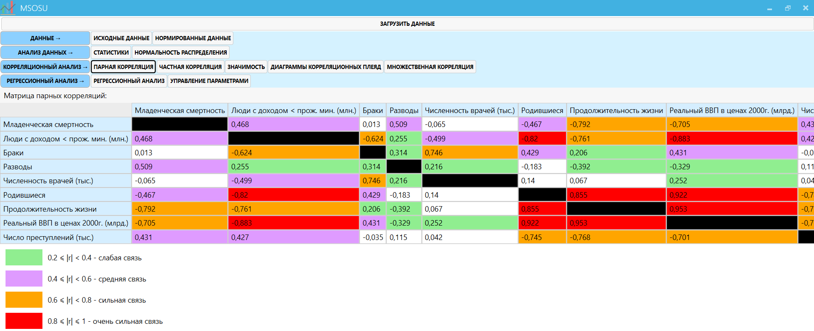
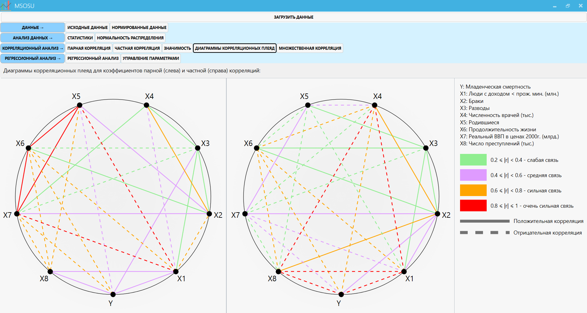
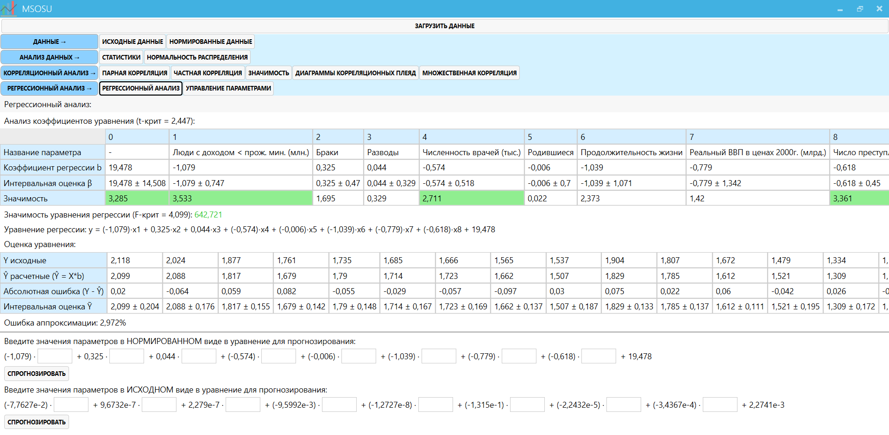

MSOsu
=============================

Программа для проведения статистического анализа. Курсовая работа. 

Возможности
------------
- Вывод описательной статистики
- Определения нормальности распределения
- Отображение матрицы парных и частных корреляций и значимость их коэффициентов
- Построение диаграммы корреляционных плеяд
- Множественная корреляция
- Регрессионный анализ с возможностью прогнозирования

Установка
------------

Исполняемый файл и пример входных данных находятся в папке "Exe". Необходим .NET Framework 4.7.1 и выше. 

Скриншоты
------------

